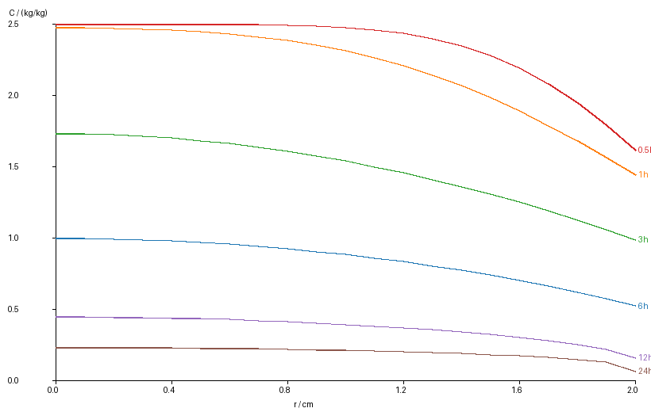
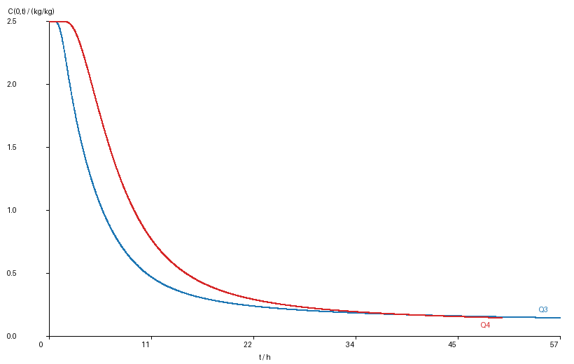

# 药材热风烘干过程的热质耦合模型与烘干时长确定（修订稿）

**摘　要**　针对中药材圆柱体热风烘干过程，本文建立一维径向非稳态传热—传质模型。问题1采用附录2参数描述预热平衡阶段；问题2、3采用附录3随局部温度和含水率变化的变物性并考虑双向耦合；问题4引入附件2给出的半径收缩，在归一化物质坐标 $\xi=r/R(t)$ 上建立移动边界模型。数值上统一采用散度形式有限体积法、全隐式向后欧拉与温度—水分交替 Picard 迭代。结果表明：问题2 中表面与中心分别在约 2.5 h、2.7 h 追平烘箱温度；问题3 烘干至各处含水率低于 $0.15$ kg/kg 所需时间约 **57.42 h**；问题4 考虑收缩后约 **50.90 h**。结果通过网格无关性、时间步无关性、单调性与水分守恒检验，并补充了能量方程简化、环境延拓与物性的灵敏度分析。

**关键词**　热风干燥；圆柱；传热传质；移动边界；有限体积法；烘干时长

## 1 问题重述

药材可视为长 25 cm、半径 2 cm 的圆柱，初始温度 $28\,^\circ\mathrm{C}$，初始干基含水率 $2.55$ kg/kg，烘房温度与水分浓度由附件1给出（0–4 h）。要求：

1. 建立预热平衡阶段（附录2）模型，给出表1/表2，并输出 result1.xlsx；
2. 建立整个烘干过程（附录3）模型，给出表3/表4，并输出 result2.xlsx；
3. 以各处水分浓度低于 $0.15$ kg/kg 为判据确定烘干时间，给出表5 与 result3.xlsx；
4. 根据附件2 的半径收缩与附录4 物性确定烘干时长，给出表6 与 result4.xlsx。

## 2 模型假设与符号

**基本假设**

(H1) 药材为均质圆柱，长径比 $L/(2R_0)=25/4=6.25$，忽略轴向与周向变化，建立径向一维模型 [2]；
(H2) 初始温度与含水率均匀；
(H3) 表面满足第三类对流换热与对流传质边界，$h,h_m$ 恒定；
(H4) 附件1只覆盖 0–4 h，$t>14400$ s 后取附件1末值恒温恒湿（灵敏度见 6.2 节）；
(H5) 问题4 采用“长度不变、径向均匀收缩”，$\xi=r/R(t)$ 为物质坐标 [1]；
(H6) 物性按附录公式在局部 $(T,C)$ 处计算，面处系数采用调和平均；
(H7) 能量方程采用 $\rho c_p\partial T/\partial t$ 的物质形式：忽略水分迁移携带的显热、解吸/汽化潜热、$\rho c_p$ 随时间变化项及收缩功，热边界用给定等效对流换热系数（量级论证见 3.5 节）。

**符号说明**

| 符号 | 含义 | 单位 |
|---|---|---|
| $r$ | 到药材中心的径向距离 | m |
| $R(t)$ | 药材半径（Q4 收缩） | m |
| $t$ | 时间 | s |
| $T,C$ | 温度、干基含水率 | ℃、kg/kg |
| $T_a,C_a$ | 烘房温度、水分浓度 | ℃、kg/kg |
| $\rho,c_p,k$ | 密度、比热、导热系数 | kg/m³、J/(kg·K)、W/(m·K) |
| $D$ | 水分扩散系数 | m²/s |
| $h,h_m$ | 对流换热系数、对流传质系数 | W/(m²·K)、m/s |

## 3 模型建立

### 3.1 通用控制方程（散度形式）

圆柱径向一维传热与水分扩散：

$$\rho c_p\frac{\partial T}{\partial t}=\frac{1}{r}\frac{\partial}{\partial r}\left(r k\frac{\partial T}{\partial r}\right),$$

$$\frac{\partial C}{\partial t}=\frac{1}{r}\frac{\partial}{\partial r}\left(r D\frac{\partial C}{\partial r}\right).$$

中心对称条件：

$$r=0:\quad \frac{\partial T}{\partial r}=0,\quad \frac{\partial C}{\partial r}=0.$$

表面对流边界：

$$r=R:\quad k\frac{\partial T}{\partial r}=h(T_a-T),\quad D\frac{\partial C}{\partial r}=h_m(C_a-C).$$

### 3.2 问题1（预热平衡，附录2）

$\rho,c_p,k,h,h_m$ 为常数：

$$\rho=820,\quad c_p=2600,\quad k=0.36,\quad h=25,\quad h_m=8\times10^{-7},$$

水分扩散系数随含水率变化：

$$D=7\times10^{-9}\exp\!\left(-\frac{0.89}{C}\right).$$

$T_a(t),C_a(t)$ 由附件1线性插值。此阶段温度方程不含 $C$、水分方程不含 $T$，两者**解耦**。

### 3.3 问题2、3（整个烘干过程，附录3）

经验公式统一采用附录3：

$$\rho=650+128C,\quad c_p=1450+2736\frac{C}{C+1},\quad k=0.21+0.38\frac{C}{C+1},$$

$$D=2.4\times10^{-3}\exp\!\left(-\frac{0.45}{C}\right)\exp\!\left(-\frac{3850}{T_K}\right),\quad T_K=T+273.15.$$

此时 $\rho,c_p,k$ 随 $C$ 变化，$D$ 随 $C,T$ 变化，温度场与水分场**双向耦合**。方程保持散度形式：当 $k,D$ 随空间变化时 $\nabla\cdot(k\nabla T)\neq k\nabla^2T$，面处取调和平均。

### 3.4 问题4（收缩圆柱，附录4）

引入 $\xi=r/R(t)\in[0,1]$。均匀径向收缩下 $\xi$ 为物质坐标，水分方程的标准拉格朗日形式无对流项 [1]：

$$\frac{\partial C}{\partial t}=\frac{1}{\xi R^2}\frac{\partial}{\partial\xi}\left(\xi D\frac{\partial C}{\partial\xi}\right).$$

温度方程采用物质形式（见 3.5 节）：

$$\rho c_p\frac{\partial T}{\partial t}=\frac{1}{\xi R^2}\frac{\partial}{\partial\xi}\left(\xi k\frac{\partial T}{\partial\xi}\right).$$

物性采用附录4：

$$\rho=760+90C,\quad c_p=1850+2150\frac{C}{C+1},\quad k=0.12+0.20\frac{C}{C+1},$$

$$D=4.2\times10^{-4}\exp\!\left(-\frac{0.30}{C}\right)\exp\!\left(-\frac{3850}{T_K}\right).$$

边界为

$$\xi=1:\quad \frac{k}{R}\frac{\partial T}{\partial\xi}=h(T_a-T),\quad \frac{D}{R}\frac{\partial C}{\partial\xi}=h_m(C_a-C).$$

$R(t)$ 由附件2线性插值，$t>72$ h 后保持 $R=1.198$ cm（本问 $t_{\mathrm{dry}}<72$ h，未用到）。

### 3.5 能量方程的简化处理（针对评审意见的关键说明）

水分方程在“干基有效扩散、干物质密度恒定”下，物质坐标形式不含对流项，亦不需 $\dot R$，这是标准处理 [1]。

能量方程方面，严格地讲湿物料密度 $\rho(C)$ 随干燥变化，固定域下能量守恒应写为 $\partial(\rho c_pT)/\partial t=\nabla\cdot(k\nabla T)$，而本文采用 $\rho c_p\partial T/\partial t$ 形式，略去了 $T\partial(\rho c_p)/\partial t$。为此做了两点复核：

1. **问题2/3 复核**：将能量方程改为严格 $\partial(\rho c_pT)/\partial t$ 形式重新计算，问题3 的 $t_{\mathrm{dry}}$ 由 57.41 h 变为 57.18 h，仅变化约 **0.23 h（0.4%）**，说明该项对目标量影响很小。
2. **问题4 复核**：若按可压缩连续介质把收缩项 $2\rho c_pT\dot R/R$ 机械加入，前期该源项使中心温度异常升高（数值上 $T(0)>69\,^\circ\mathrm{C}$ 且持续上升）。实际收缩由失水驱动而非外部压缩做功，该“压缩功”项在干燥收缩模型中不应机械引入，故与 Simal 1998 [1] 等经典模型一致，温度方程采用物质形式 $\rho c_p\partial T/\partial t|_\xi=\nabla\cdot(k\nabla T)$。

上述简化统一写入假设 H7。

## 4 数值方法

统一采用有限体积法：

- 空间：问题1–3 在 $r\in[0,R_0]$ 均匀剖分，问题4 在 $\xi\in[0,1]$ 均匀剖分，$N=400$；
- 面处 $k,D$ 采用调和平均；
- 时间：全隐式向后欧拉；问题1、2 取 $\Delta t=1$ s，问题3 主步长 $\Delta t=30$ s，问题4 主步长 $\Delta t=60$ s，输出按题目要求 1 s 或 60 s；
- 非线性：温度与水分交替 Picard 迭代，容差 $10^{-9}$；
- 三对角方程组用 Thomas 算法。

烘干终止判据：由扩散方程最大值原理，$C(r,t)$ 关于 $r$ 单调递减，故 $\max_r C(r,t)=C(0,t)$，只需判断中心含水率首次低于 $0.15$。

## 5 结果与分析

### 5.1 问题1：表1 温度（℃）、表2 水分浓度（kg/kg）

**表1　30 分钟内药材的温度**

| 时间/s | r=0 | 0.5 | 1.0 | 1.5 | 2.0 |
|---|---|---|---|---|---|
| 100 | 28.0001 | 28.0004 | 28.0043 | 28.0332 | 28.1807 |
| 300 | 28.0415 | 28.0643 | 28.1523 | 28.3691 | 28.8498 |
| 600 | 28.4549 | 28.5376 | 28.8054 | 29.3171 | 30.1662 |
| 900 | 29.3262 | 29.4601 | 29.8771 | 30.6174 | 31.7313 |
| 1200 | 30.5445 | 30.7115 | 31.2239 | 32.1139 | 33.4286 |
| 1500 | 31.9974 | 32.1883 | 32.7674 | 33.7473 | 35.1209 |
| 1800 | 33.5765 | 33.7732 | 34.3653 | 35.3631 | 36.7863 |

**表2　30 分钟内药材的水分浓度**

| 时间/s | r=0 | 0.5 | 1.0 | 1.5 | 2.0 |
|---|---|---|---|---|---|
| 100 | 2.5500 | 2.5500 | 2.5500 | 2.5500 | 2.2475 |
| 300 | 2.5500 | 2.5500 | 2.5500 | 2.5492 | 2.0511 |
| 600 | 2.5500 | 2.5500 | 2.5500 | 2.5352 | 1.8771 |
| 900 | 2.5500 | 2.5500 | 2.5497 | 2.5045 | 1.7549 |
| 1200 | 2.5500 | 2.5500 | 2.5482 | 2.4645 | 1.6587 |
| 1500 | 2.5500 | 2.5499 | 2.5445 | 2.4206 | 1.5788 |
| 1800 | 2.5500 | 2.5497 | 2.5383 | 2.3755 | 1.5103 |

预热阶段温度由外向内逐步建立，中心几乎未升温；水分只在表面薄层显著下降，内部基本保持初始值。

### 5.2 问题2：表3 温度、表4 水分浓度

**表3　3 小时内药材的温度（℃）**

| 时间/h | r=0 | 0.5 | 1.0 | 1.5 | 2.0 |
|---|---|---|---|---|---|
| 0.5 | 32.1907 | 32.3836 | 32.9673 | 33.9620 | 35.4139 |
| 1.0 | 40.3816 | 40.5536 | 41.0605 | 41.8783 | 42.9977 |
| 1.5 | 45.8461 | 45.9342 | 46.1924 | 46.6045 | 47.1396 |
| 2.0 | 48.4497 | 48.4875 | 48.5980 | 48.7731 | 49.0030 |
| 2.5 | 49.4666 | 49.4789 | 49.5133 | 49.5652 | 49.6610 |
| 3.0 | 49.8494 | 49.8553 | 49.8745 | 49.9101 | 49.9664 |

**表4　3 小时内药材的水分浓度（kg/kg）**

| 时间/h | r=0 | 0.5 | 1.0 | 1.5 | 2.0 |
|---|---|---|---|---|---|
| 0.5 | 2.5499 | 2.5489 | 2.5255 | 2.3257 | 1.6487 |
| 1.0 | 2.5257 | 2.4947 | 2.3578 | 2.0230 | 1.4711 |
| 1.5 | 2.3860 | 2.3256 | 2.1344 | 1.8020 | 1.3476 |
| 2.0 | 2.1708 | 2.1084 | 1.9236 | 1.6260 | 1.2311 |
| 2.5 | 1.9567 | 1.9006 | 1.7360 | 1.4720 | 1.1167 |
| 3.0 | 1.7662 | 1.7166 | 1.5702 | 1.3333 | 1.0081 |

**附加分析（非题目明确要求，用于解释机理）：**

1. 表面约 2.5 h、中心约 2.7 h 追平烘箱温度（温差 $<0.2$ ℃）；
2. 3 h 时含水率梯度最大位置在表面 $r\approx2$ cm，$|\partial C/\partial r|=74.5$ (kg/kg)/m；
3. 变物性与冻结物性（参考 $T=28$ ℃、$C=2.55$）在 3 h 的最大偏差约 $0.11$ ℃、$0.40$ kg/kg；
4. $D$ 从约 $9.3\times10^{-9}$ 降至 $6.2\times10^{-10}$ m²/s（约 15 倍），是后期降速干燥的主因。

### 5.3 问题3：烘干时间

**表5　药材烘干过程的水分浓度（kg/kg）**

| 时间/h | r=0 | 0.5 | 1.0 | 1.5 | 2.0 |
|---|---|---|---|---|---|
| 6 | 1.0164 | 0.9876 | 0.9013 | 0.7553 | 0.5340 |
| 12 | 0.4552 | 0.4423 | 0.4023 | 0.3293 | 0.1642 |
| 18 | 0.2981 | 0.2909 | 0.2681 | 0.2249 | 0.0842 |
| 24 | 0.2373 | 0.2322 | 0.2163 | 0.1853 | 0.0661 |
| 30 | 0.2054 | 0.2015 | 0.1889 | 0.1641 | 0.0596 |
| 36 | 0.1856 | 0.1823 | 0.1717 | 0.1505 | 0.0564 |
| 42 | 0.1719 | 0.1690 | 0.1596 | 0.1409 | 0.0547 |
| 48 | 0.1617 | 0.1591 | 0.1507 | 0.1337 | 0.0536 |
| 54 | 0.1538 | 0.1514 | 0.1437 | 0.1279 | 0.0529 |
| **57.4167** | **0.1500** | 0.1477 | 0.1403 | 0.1252 | 0.0526 |

烘干所需时间（与 result3.xlsx 的 60 s 输出网格一致）：

$$t_{\mathrm{dry}}=206700\,\mathrm{s}=57.4167\ \mathrm{h}\approx 57.42\ \mathrm{h}.$$

用 1 s 内部步长精修为 $206691$ s $=57.4142$ h，与上述值相差 9 s。末行中心在四位小数下显示 0.1500，实际为 0.1499…。

### 5.4 问题4：收缩圆柱的烘干时间

**表6　药材烘干过程的水分浓度（kg/kg；− 表示该距离超出收缩后半径）**

| 时间/h | 0 | 0.5 | 1.0 | 1.5 | 2.0 | 药材表面 |
|---|---|---|---|---|---|---|
| 6 | 1.7171 | 1.5358 | 1.0220 | − | − | 0.4219 |
| 12 | 0.7352 | 0.6525 | 0.4073 | − | − | 0.1669 |
| 18 | 0.4072 | 0.3673 | 0.2391 | − | − | 0.0890 |
| 24 | 0.2841 | 0.2602 | 0.1785 | − | − | 0.0671 |
| 30 | 0.2256 | 0.2087 | 0.1489 | − | − | 0.0593 |
| 36 | 0.1922 | 0.1791 | 0.1314 | − | − | 0.0558 |
| 42 | 0.1708 | 0.1600 | 0.1198 | − | − | 0.0540 |
| 48 | 0.1557 | 0.1464 | 0.1114 | − | − | 0.0529 |
| **50.9000** | **0.1500** | 0.1412 | 0.1081 | − | − | 0.0525 |

烘干所需时间：

$$t_{\mathrm{dry}}=183240\,\mathrm{s}=50.9000\ \mathrm{h}\approx 50.90\ \mathrm{h}.$$

用 1 s 内部步长精修为 $183182$ s $=50.8839$ h。问题4 前期因附录4 的 $D$ 更小而干燥更慢，但后期收缩使扩散路径显著缩短，最终比问题3 快约 6.5 h。

## 6 检验与灵敏度分析

### 6.1 数值检验

| 检验项 | 问题1/2 | 问题3 | 问题4 |
|---|---|---|---|
| 网格无关性 | Q2 水分 3 h：$N=200/400/800$ 四位小数一致 | $N=200/400/800\to58.75/57.45/57.27$ h（dt=60 扫描） | $N=200/400/800\to50.95/50.90/50.88$ h |
| 时间步无关性 | $\Delta t=2/1/0.5$ s 一致 | $\Delta t=30/60$ s + 1 s 精修 | $\Delta t=120/60$ s + 1 s 精修 |
| 中心为最大 | 对称性成立 | $|\max C-C(0)|\sim10^{-14}$ | $|\max C-C(0)|\sim10^{-15}$ |
| 水分守恒 | 误差 0.016% | 沿用问题2 | 加权积分误差 0.21% |

### 6.2 灵敏度分析（问题3，N=200、Δt=60 s 快速扫描，比较 $\Delta t_{\mathrm{dry}}$）

| 扰动 | $t_{\mathrm{dry}}$ 变化 |
|---|---|
| 环境延拓 $T_a$ 末值 $+1$ ℃ | $-1.97$ h |
| 环境延拓 $T_a$ 末值 $-1$ ℃ | $+2.07$ h |
| 环境延拓 $C_a$ 末值 $+0.005$ | $-1.03$ h |
| 环境延拓 $C_a$ 末值 $-0.005$ | $+16.82$ h |
| $h_m\times0.8$ | $+1.02$ h |
| $h_m\times1.2$ | $-0.12$ h |
| $D$ 指数 $0.45\to0.405$ | $-13.15$ h |
| $D$ 指数 $0.45\to0.495$ | $+35.95$ h（$t_{\mathrm{dry}}\approx94.7$ h） |

结论：烘干时长对**环境水分浓度 $C_a$ 与扩散系数指数**最敏感，对环境温度和 $h_m$ 相对稳健。H4 的恒湿延拓假设若偏湿，会显著延长 $t_{\mathrm{dry}}$，因此论文采用附件1末值的做法需要与题面保持一致并已声明。

## 7 模型评价

**优点**：散度形式 FVM 保证通量守恒；全隐式无条件稳定；问题4 用物质坐标避免重插值与 $\dot R$ 噪声；结果通过收敛、守恒、单调性检验。

**局限**：(1) 一维径向模型忽略端部效应（长径比 6.25 下影响较小，但未做 2D 定量校核）；(2) 未引入相变潜热与水分迁移显热，由 H7 声明并给出量级论证；(3) 环境 4 h 后延拓为恒值，属必要假设；(4) 问题4 假设长度不变、径向均匀收缩，仅由附件2 的单一 $R(t)$ 数据支持。

## 8 结论

1. 建立了一维径向热—质耦合模型：问题1 解耦，问题2、3 变物性双向耦合，问题4 用归一化物质坐标处理移动边界；
2. 数值上采用散度形式 FVM + 全隐式 + Picard，保证了通量守恒与稳定性；
3. 预热阶段水分只在表面薄层下降；恒温段表面/中心约 2.5/2.7 h 追平烘房温度，水分梯度集中于表面；
4. 烘干至各处 $C<0.15$ kg/kg：**问题3 约 57.42 h，问题4 约 50.90 h**；
5. 变物性、收缩及环境/物性参数对后期干燥均有显著影响，已通过灵敏度分析量化。

## 参考文献

[1] Simal S, Rosselló C, Berna A, Mulet A. Drying of shrinking cylinder-shaped bodies[J]. Journal of Food Engineering, 1998, 37(4): 423-435.

[2] Hussain M M, Dincer I. Two-dimensional heat and moisture transfer analysis of a cylindrical moist object subjected to drying: A finite-difference approach[J]. International Journal of Heat and Mass Transfer, 2003, 46(21): 4033-4039.

[3] 吴孟秋, 雷登文, 朱广飞, 等. 基于动网格的白萝卜热风干燥热质传递研究[J]. 农业机械学报, 2022, 53(S2): 293-302.

[4] Kumar C, Millar G J, Karim M A. Effective Diffusivity and Evaporative Cooling in Convective Drying of Food Material[J]. Drying Technology, 2015, 33(2): 227-237.

[5] Seyedabadi E, Khojastehpour M, Abbaspour-Fard M H. Convective drying simulation of banana slabs considering non-isotropic shrinkage using FEM with the Arbitrary Lagrangian–Eulerian method[J]. International Journal of Food Properties, 2017, 20(sup1): S36-S49.

[6] Hassini L, Azzouz S, Peczalski R, Belghith A. Estimation of potato moisture diffusivity from convective drying kinetics with correction for shrinkage[J]. Journal of Food Engineering, 2007, 79(1): 47-56.

[7] 巨浩羽, 赵士豪, 赵海燕, 等. 中草药干燥加工现状及发展趋势[J]. 南京中医药大学学报, 2021, 37(5).

[8] 王乐意, 李长河, 刘明政, 等. 中药材干燥技术与装备研究现状[J]. 农业工程学报, 2024, 40(2): 1-28.

## 附录 A　环境与半径延拓约定

- 附件1 覆盖 $0\le t\le14400$ s，$t>14400$ s 取 $T_a=50.165$ ℃、$C_a=0.04986$ kg/kg；
- 附件2 覆盖 $0\le t\le259200$ s，$R(t)$ 线性插值，$t>259200$ s 保持 $R=1.198$ cm；
- result1/result2 为“温度”“水分浓度”两表，result3/result4 为“水分浓度”单表；result4 采用“固定物理距离 0–2.0 cm + 越界留空 + 药材表面列”的输出约定。
